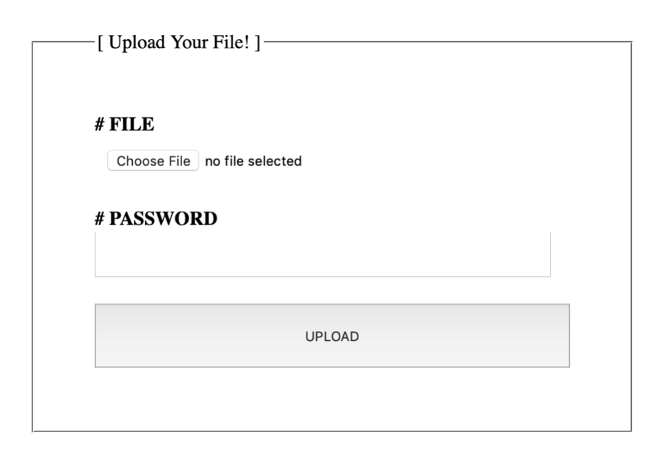
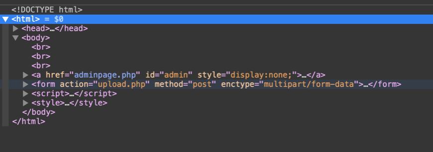
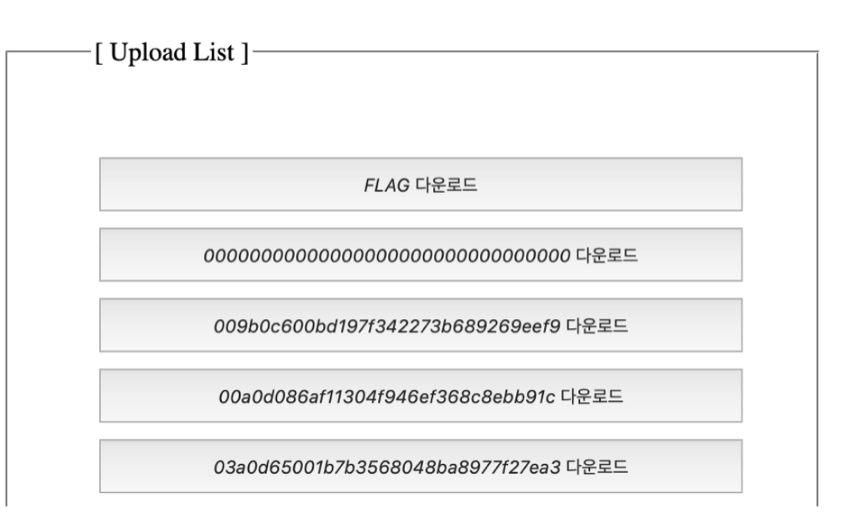
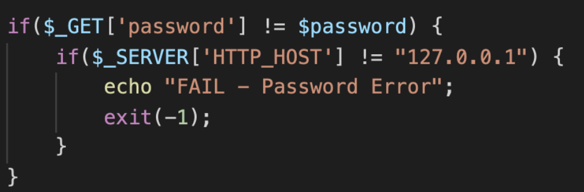
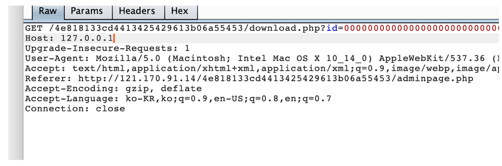
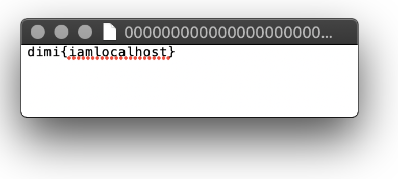
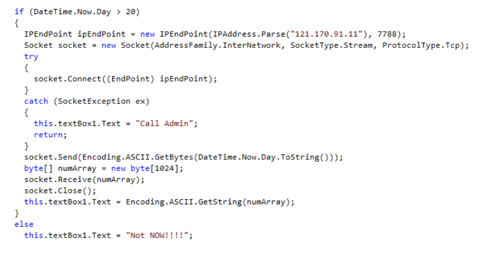
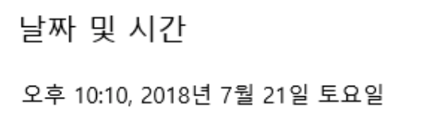
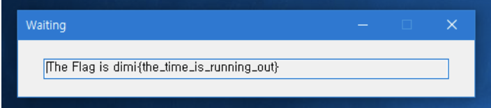

# DIMICTF 2018 예선
1330p로 24위를 했다!
작년엔 예선 10위, 본선 3위였는데 많이 떨어졌다ㅠㅠ
## misc
### MIC CHECK (560p)
마이크 테스트 문제다.
```
Can you speak?
FLAG: dimi{Hello, DIMIGO!}
```
FLAG: `dimi{Hello, DIMIGO!}`

## reversing
### EZPZ (770p)
문제파일을 받고 실행시키면 입력창과 GO버튼만 나오고 최소화되서 아무것도 할 수 없다.
PEID로 확인해보니까 .NET이라길래 닷픽으로 풀었다.
```c#
if (string.Compare(this.INPUT.Text, "Welcome_reversing") != 0)
    return;
int num = (int) MessageBox.Show("dimi{" + this.INPUT.Text + "}");
```
이런 코드가 있는데, 
`INPUT.Text`의 값이 `Welcome_reversing`이라면 `dimi{}`안에 끼워서 출력해주는 것 같다.<br>
FLAG: `dimi{Welcome_reversing}`

# DIMICTF 2018 본선
작년에 비해 본선도 많이 떨어졌다ㅜㅜ
아깝게 은상에서 마지막에 밀리고 가장 높은 순위로 동상을 받았다.
## misc
### guess_return
이 문제 푸는데 가장 많은 시간을 투자 했던 것 같다.
지문
```
Do you remember? This time it is not image, It is just some bit ;)
```
문제 파일로 `flag.bit`가 주어지는데,
내용은 다음과 같다
```
2ykuozF
```
처음에는 저번에 나온 `imgur guess`랑 비슷한 것 같아서 `imgur`에 넣어봤지만 안됬다.
구글링도 해보고 삽질 하다가 bit.. bit.. bit.. bit.ly??????????가 떠올라서
`bit.ly/2ykuozF`에 넣어보니까 FLAG가 나왔다.<br>
FLAG: `dimi{Th1s_1s_3xp3r1enc3_b4sed_gu3ss1ng_1sn't_1t?}`

### math
작년 DIMICTF에서도 나오고 이런 종류가 많이 나온다.
예선 때는 숫자야구, 작년에도 비슷한게 나왔는데 정확하게는 기억이 안난다.
문제 지문에 나와있는 `nc 121.170.91.11 9999`로 접속 해보니까 `1+9`같은 수학 문제가 나온다. 처음에는 간단한 수학연산인 것 같아 해보다가 후반까지 가니까 복잡해져서 `pwntools`와 파이썬 `eval`을 사용해서 풀었다.
```python
from pwn import *

conn = remote('121.170.91.11', 9999)

for i in range(0, 20):
    conn.recvuntil('Question> ')
    cal = conn.recv(1000)
    cal = cal.replace(' = ?', '')
    cal = cal.replace('ANSWER>', '')
    cal = cal.replace('\n', '')
    print cal # inequation
    conn.sendline(str(eval(cal))) # calculate by eval()
    print conn.recv()

print "FLAG: "+conn.recv()
```
실행 결과는 다음과 같다.
```
---------생략---------
8914%697+6156*9916+2354
Correct!

3240-4722*5488*4868-5188
Correct!

FLAG: Congratulation! The flag is dimi{Yeah, you are good at math!:)}

[*] Closed connection to 121.170.91.11 port 9999
```
FLAG: `dimi{Yeah, you are good at math!:)}`

## web
### DimiStorage
문제 링크에 들어가면

이런 화면이 나와서 요소 검사를 해보니

adminpage.php가 보인다. 들어가 보자

이렇게 사람들이 업로드한 파일들이 보인다<br>
여기까지 보고, 이제 주어진 소스코드를 보자

입력한 password가 맞지 않으면서 `$_SERVER[’HTTP_HOST’]`가 `127.0.0.1`이 아니라면 실패하고, 아닌건 모두 다운로드 된다.
하드코딩된 password를 알아내는건 거의 불가능 하므로 우리는 `$_SERVER[’HTTP_HOST’]`를 조작해보자
`$_SERVER[’HTTP_HOST’]`는 프록시 툴로 간편하게 조작이 가능하다.

위에 있는 사진은 FLAG 다운로드 버튼을 누른후 request header에서 HOST 값을 `127.0.0.1`로 바꾼 상태 이다
이렇게 조작하고 forward를 누르면 `FLAG`가 다운로드 된다

FLAG: `dimi{iamlocalhost}`

## reversing
### waiting
처음 실행하면 `Not NOW!!` 라고 뜬다.
이걸로 시간이랑 뭔가 연관이 있는 프로그램이라는 것을 알아냈다<br>
이 프로그램을 DotPeek으로 디컴파일 해보니 오늘의 날짜가 20보다 크다면 소켓으로 무언갈 가져와 출력해주는 것 같다
20보다 크지 않다면 아까처럼 `Not NOW!!`를 출력한다<br>

그래서 나는 윈도우의 날짜를 21일로 바꿨다

이제 플래그가 나왔다

flag: `dimi{the_time_is_running_out}`