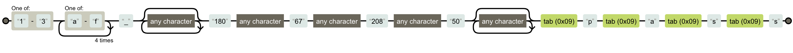

# webhacking.kr write-up

## Challenge 1
```php
$password="????";
if(eregi("[^0-9,.]",$_COOKIE[user_lv])) $_COOKIE[user_lv]=1;
if($_COOKIE[user_lv]>=6) $_COOKIE[user_lv]=1;
if($_COOKIE[user_lv]>5) @solve();
echo("<br>level : $_COOKIE[user_lv]");
```
`user_lv`가 6 이상이면 `user_lv`가 1로 되돌아가고, `user_lv`가 5보다 크면 풀리게 된다.
5 < `user_lv` < 6 이면 된다는 것이다. `user_lv`가 5.xx면 풀릴 것 같다.
### payload
`document.cookie = "user_lv=5.1"`

## Challenge 11
처음 문제 페이지에 들어가면 
```php
$pat="/[1-3][a-f]{5}_.*180.67.208.50.*\tp\ta\ts\ts/";
if(preg_match($pat,$_GET[val])) { echo("Password is ????"); }
```
가 나온다.
정규표현식이 나와있고, 그 정규표현식을 만족하는 `$_GET[val]`값을 찾아 넣으면 풀릴 것 같다.
우선 정규표현식을 분석하기 쉽게 regexper.com에 `$pat`값을 넣어봤다.

그냥 위에 사진처럼 나온대로 문자열을 만들면 된다.
나는 `1aaaaa_a180a67a208a50%09p%09a%09s%09s`로 했다.
`%09`로 한 이유는 탭을 그냥 URL에 넣으면 공백 한칸으로 인식되기 떄문이다.

## Challenge 18
```php
if(eregi(" |/|\(|\)|\t|\||&|union|select|from|0x",$_GET[no])) exit("no hack"); 
$q=@mysql_fetch_array(mysql_query("select id from challenge18_table where id='guest' and no=$_GET[no]")); 
if($q[0]=="guest") echo ("hi guest"); 
if($q[0]=="admin") { 
    @solve(); 
    echo ("hi admin!"); 
} 12
```

## Challenge 21
`BLIND SQL INJECTION` 문제라고 페이지에서 알려주고 있다. no에 1과 2를 넣었을 때만 `True`라고 뜨는 것을 보아 2개의 계정만 Injection하면 될 것 같다.
간단하게 파이썬으로 프로그램 짜서 풀었다.

### payload
[https://github.com/uhmtoto/Exploit-Code/blob/master/webkr_21.py](https://github.com/uhmtoto/Exploit-Code/blob/master/webkr_21.py)
### result
```
no1 id : guest
no1 pw : guest
no2 id : admin
no2 pw : blindsqlinjectionkk
```

## Challenge 23
`Your mission is to inject <script>alert(1);</script>`이라고 한다.
그냥 GET으로 넘길 때 code값 맨 앞에 NULL(%00)을 추가해 주면 풀린다.
### payload
`http://webhacking.kr/challenge/bonus/bonus-3/index.php?code=%00<script>alert(1);</script>`

## Challenge 36
정말 아무것도 없이
```
hint

vi
blackout
```
만 나온다.
`vi`와 `blackout`을 보니까 `vim`에서 중간에 저장없이 꺼지면 `.파일명.swp`로 저장된다는게 생각나서 `URL/.index.php.swp`로 넣어봤는데 404 떠서 구글링 하다가 `.swp` 말고도 `.swo`, `.swn` 으로 저장되는 파일도 있다고 해서 다 해봤는데 안됬다. 결국 풀이를 봤는데 처음에 시도한 `URL/.index.php.swp`에 플래그가 있었다고 한다.. 왜인지는 모르겠지만 이제 풀 수 없는 문제 같다.

## Challenge 58
문제 페이지에 들어가면 플래시로 되어있는 로그인 창이 뜬다. 게싱으로 몇 가지 패스워드를 넣어봤지만 되지 않아서 플래시 파일을 다운로드 받은뒤 iHex로 열었다. 파일 맨 뒷 부분에 보면 `http://webhacking.kr/challenge/web/web-35/g1v2m2passw0rd.php`이 있다. 들어가면 문제가 풀린다!