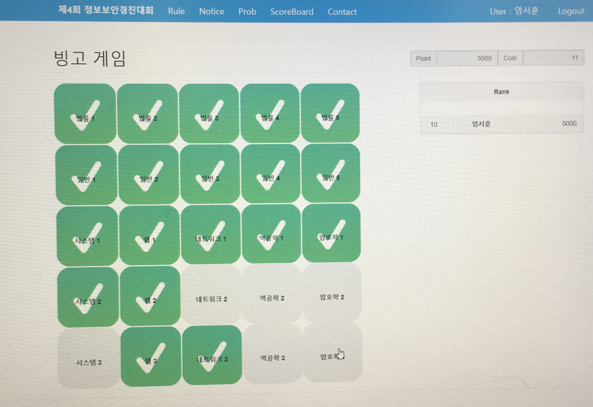

# 2018년 제 4회 정보보안경진대회 예선
전국 4개 정보보호영재교육원에서 하는 대회인데, 중고등학생 합쳐서 300명이 참가한 것 같다. 그 중에서 10등에 들어서 서울대에서 하는 본선에 나갈 수 있었는데, 디미고 면접날이라 본선에 못나간다....

# 풀이
대회 사이트와 문제가 영재원 내부에서만 접속되서 자세한 내용은 없다.

## Law, General
정보보안과 침해사고 등에 대한 내용을 묻는 문제들이다.
구글링으로 쉽게 풀 수 있었다.

## Web
### 01
필터링이 없는 SQL Injection 문제였다.
아이디에 `admin`, 비밀번호에 `' or '1'='1`을 넣으니까 바로 풀렸다.
### 02
문제 페이지에 들어가면 이상하게 깨져있는 이미지가 뜬다.
소스를 보면 JS로 이미지를 shuffle 하는 것을 확인 할 수 있는데, 이미지 URI를 찾아서 직접 들어가거나 shuffle 하는 부분을 빼고 크롬 콘솔에서 이미지 출력을 다시 하면 된다.
### 03
XSS 문제였다. 문의사항을 올리는 페이지가 있는데, 제목과 내용을 입력하는 글이 올라간다. 제목에 특수문자를 넣으면 에러가 발생해서 게시글 내용에 Stored XSS를 하면 됬다. 페이로드는 기억 안나지만 플래그는 서버에 남아있다. 
flag: `flag{w3_give_@dviCe_bUT_w3_CaNnoT_give_C0NdUct}`

## Rev
### 01
어떤 파일이 주어지는데, 에디터로 열어보면 gdb로 디버깅한 결과들이 적혀있다. 그냥 보이는 16진수 값 하나를 10진수로 바꿔서 넣어보니까 풀렸다.

## System
### 01
입력한 한 줄의 명령을 실행시켜주는 프로그램인데, 그 한 줄안에 `pa`라는 문자열이 있어야 실행이 된다.
페이로드가 정확하게 기억나지는 않지만 `pa & tail [a-z]lag` 정도로 기억난다. 필터링 되는 글자를 와일드카드로 처리하면 되는 문제였다.
### 02
시스템 1번보다 훨신 쉬웠다. 그냥 `cat flag`치니까 플래그가 떴다.

## Net
### 01
그냥 와이어샤크에서 스트링 검색에 `flag{`치고 몇 개 뒤지니까 플래그 떴다.
### 03
시스코 라우터에 대한 문제였다. 라우터의 정보를 보고, 이름을 바꾸고, 이름을 설정하는 등 작업을 마치면 플래그를 얻을 수 있다.

## Crypto
### 01
`242E232539362D26233B622B3162212E2D37263B6C62312D622F3B622427272E2B2C25622B31622C2D3662252D2D2662272B362A27306C3F`(hex) 이런 파일이 주어진다.
이 16진수 값은 플래그와 어떤 한자리 키 값을 xor한 값이라고 한다. a ^ b = c 이면 b ^ a = c인 성질을 이용해서 풀 수 있다. 키 값은 브루트 포스로 구했는데, `0x20`이었던 것 같다.